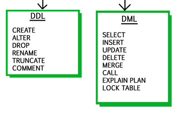

== Teoria

* *SQL*: Structured Query Language
* *DML (Data Manipulation Language)*: Per  leggere,  inserire,  modificare  e  cancellare dei dati. 
* *DDL (Data  Definition  Language)*: Per  la  definizione  della  struttura  dei  dati, delle regole di integrità e dei privilegi degli utenti.

Il *grado* di una tabella è definito dalla quantità di campi (colonne) che la compongono.

La *cardinalità* di una tabella è definita da quante tuple (righe) differenti sono presenti in una tabella.

L'*integrità referenziale* di una tabella è definita dalla presenza di una relazione che permette di collegare le tuple di due tabelle.
La violazione di quest'ultima può portare all'esecuzione di una delle seguenti azioni:

* *cascade*: elimina/aggiorna le righe delle tabelle collegate, se questa viene cancellata.
* *set null*: imposta il campo della tabella collegata a null, se questa viene cancellata.
* *set default*: ripristina il campo della tabella collegata al valore di default, se questa viene cancellata.
* *no action*: non fa niente.

Esistono vari tipi di *attributi*:

* *atomico*: un attributo è una singola stringa (indivisibile).
* *composto*: un attributo è una sequenza di stringhe (indirizzo).
* *calcolato*: un attributo è una stringa calcolata (codice fiscale).

== Struttura di una query
*CREAZIONE TABELLA*
[source,sql]
----
CREATE TABLE attori (
  CodAttore char(5) NOT NULL,
  Nome varchar(30) NOT NULL,
  AnnoNascita date DEFAULT NULL,
  Nazionalità varchar(25) DEFAULT NULL,
  PRIMARY KEY (CodAttore),
  FOREIGN KEY (Nome) REFERENCES Persone(ID_Persona) ON DELETE CASCADE
);
----

*INSERIMENTO*
[source,sql]
----
INSERT INTO attori (CodAttore, Nome, AnnoNascita, Nazionalità) VALUES
('00001', 'F.Fellini', '1957-12-10', 'usa'),
('00002', 'R.Williams', '1955-09-10', 'usa'),
('00003', 'M.Mastroianni', '1965-10-12', 'usa');
----

*AGGIORNAMENTO*
[source,sql]
----
UPDATE attori SET Nazionalità = 'italia' WHERE CodAttore = '00001';
----

oppure per aggiungere colonne (ma anche per modificare i campi già esistenti):

[source,sql]
----
ALTER TABLE attori
ADD Email varchar(255);
----

*AGGIORNAMENTO POST CREAZIONE TABELLA*
[source,sql]
----
ALTER TABLE Persone
ADD CONSTRAINT Nome PRIMARY KEY (ID);
----

*CANCELLAZIONE*
[source,sql]
----
DROP TABLE attori;
----

